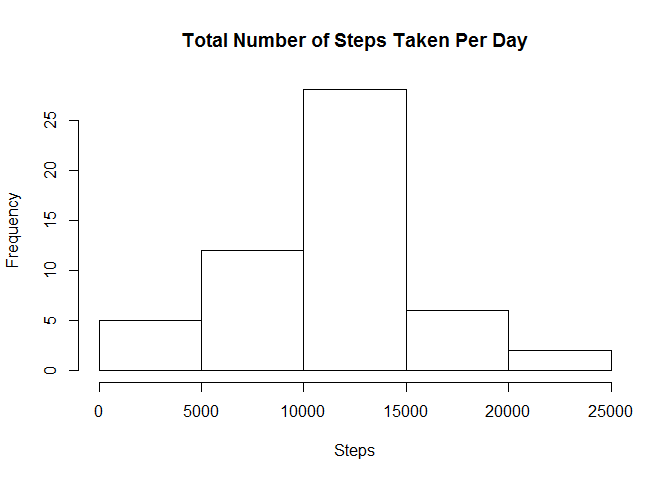
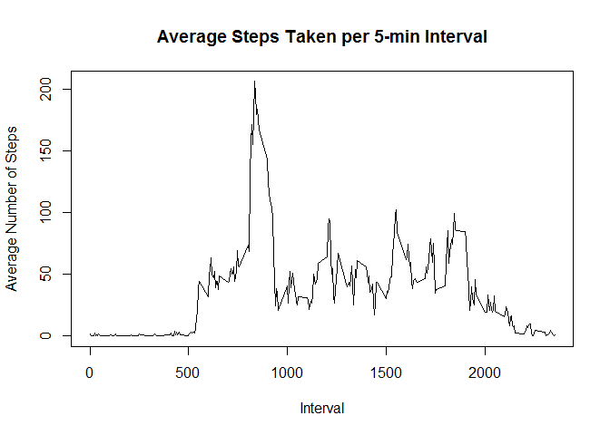
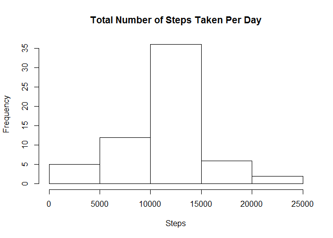
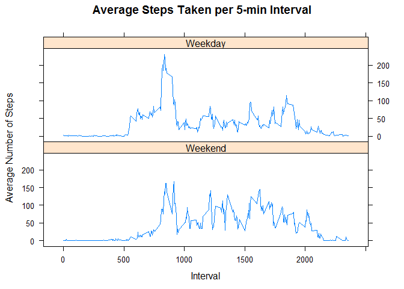

# Reproducible Research: Peer Assignment 1

## Introduction
This assignment makes use of data from a personal activity monitoring device. This device collects data at 5 minute intervals through out the day. The data consists of two months of data from an anonymous individual collected during the months of October and November, 2012 and include the number of steps taken in 5 minute intervals each day.


## Loading and preprocessing the data

1. Code for reading in the dataset and processing the data.

```r
activity <- read.csv("activity.csv", na.strings = "NA", stringsAsFactors = FALSE)
activity$date <- as.Date(activity$date, format = "%Y-%m-%d")
activity$steps <- as.numeric(activity$steps)
```

## What is mean total number of steps taken per day?

2. Histogram for the total number of steps taken each day.

```r
totalSteps <- aggregate(activity$steps~activity$date, FUN = sum, na.rm = TRUE)
names(totalSteps)[1] <- "Date"
names(totalSteps)[2] <- "Total.Steps"

hist(totalSteps$Total.Steps, main = "Total Number of Steps Taken Per Day", xlab = "Steps")
```



3. Mean and median number of steps taken daily.

```r
mean(totalSteps$Total.Steps)
```

```
## [1] 10766.19
```

```r
median(totalSteps$Total.Steps)
```

```
## [1] 10765
```

## What is the average daily activity pattern?

4. Time series plot of the average number of steps taken.

```r
avgSteps <- aggregate(activity$steps~activity$interval, FUN = mean, na.rm = TRUE)
names(avgSteps)[1] <- "Interval"
names(avgSteps)[2] <- "Average.Steps"

plot(avgSteps$Interval, avgSteps$Average.Steps, type="l", main = "Average Steps Taken per 5-min Interval", xlab = "Interval", ylab = "Average Number of Steps")
```



5. The 5-minute interval that, on average, contains the maximum number of steps

```r
avgSteps$Interval[avgSteps$Average.Steps == max(avgSteps$Average.Steps)]
```

```
## [1] 835
```

## Imputing missing values

6. Code to describe and show a strategy for imputing missing data

```r
sum(is.na(activity$steps))
```

```
## [1] 2304
```

```r
activityNEW <- activity
for(i in 1:nrow(activityNEW)) {
  for(j in 1:nrow(avgSteps)) {
    if(is.na(activityNEW[i,1])) {
      if(activityNEW[i,3] == avgSteps[j,1]) {
        activityNEW[i,1] <- avgSteps[j,2]
      }
    }
  }
}
```

## Are there differences in activity patterns between weekdays and weekends?

7. Histogram of the total number of steps taken each day after missing values are imputed

```r
totalStepsNEW <- aggregate(activityNEW$steps~activity$date, FUN = sum, na.rm = TRUE)
names(totalStepsNEW)[1] <- "Date"
names(totalStepsNEW)[2] <- "Total.Steps"

hist(totalStepsNEW$Total.Steps, main = "Total Number of Steps Taken Per Day", xlab = "Steps")
```



```r
mean(totalStepsNEW$Total.Steps)
```

```
## [1] 10766.19
```

```r
median(totalStepsNEW$Total.Steps)
```

```
## [1] 10766.19
```

8. Panel plot comparing the average number of steps taken per 5-minute interval across weekdays and weekends

```r
weekday <- c("Monday","Tuesday","Wednesday","Thursday","Friday")
activityNEW$day <- factor((weekdays(activityNEW$date) %in% weekday), levels=c(FALSE,TRUE), labels=c("Weekend","Weekday"))

avgStepsNEW <- aggregate(activityNEW$steps~activityNEW$interval+activityNEW$day, FUN = mean, na.rm = TRUE)
names(avgStepsNEW)[1] <- "Interval"
names(avgStepsNEW)[2] <- "Day"
names(avgStepsNEW)[3] <- "Average.Steps"

library(lattice)
xyplot(avgStepsNEW$Average.Steps ~ avgStepsNEW$Interval| avgStepsNEW$Day, type="l", layout=c(1,2), main = "Average Steps Taken per 5-min Interval", xlab = "Interval", ylab = "Average Number of Steps")
```


